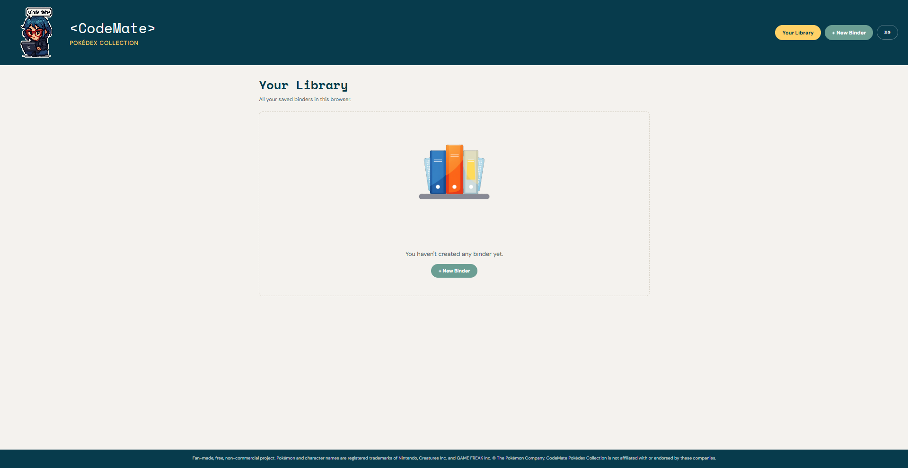
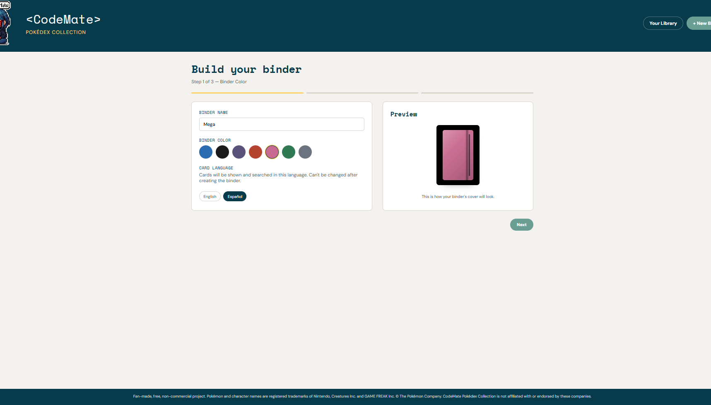
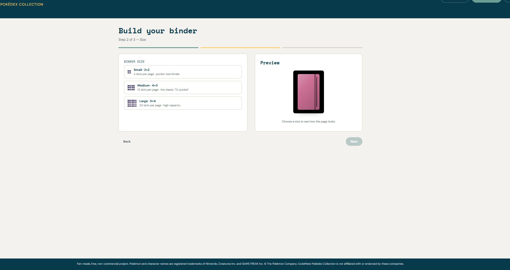
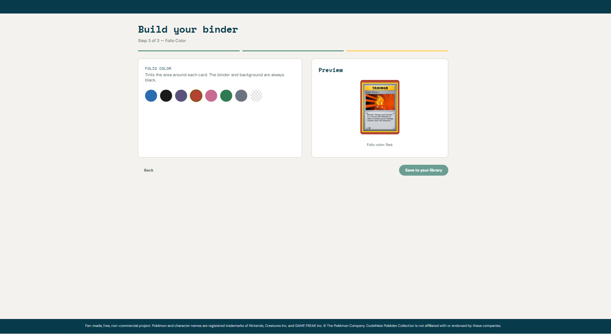
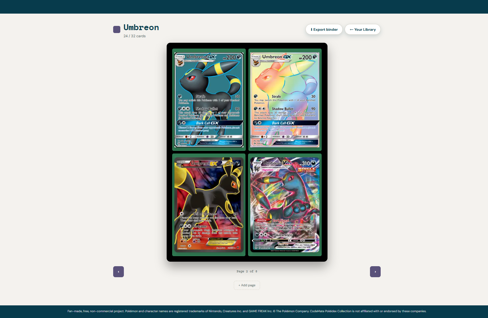
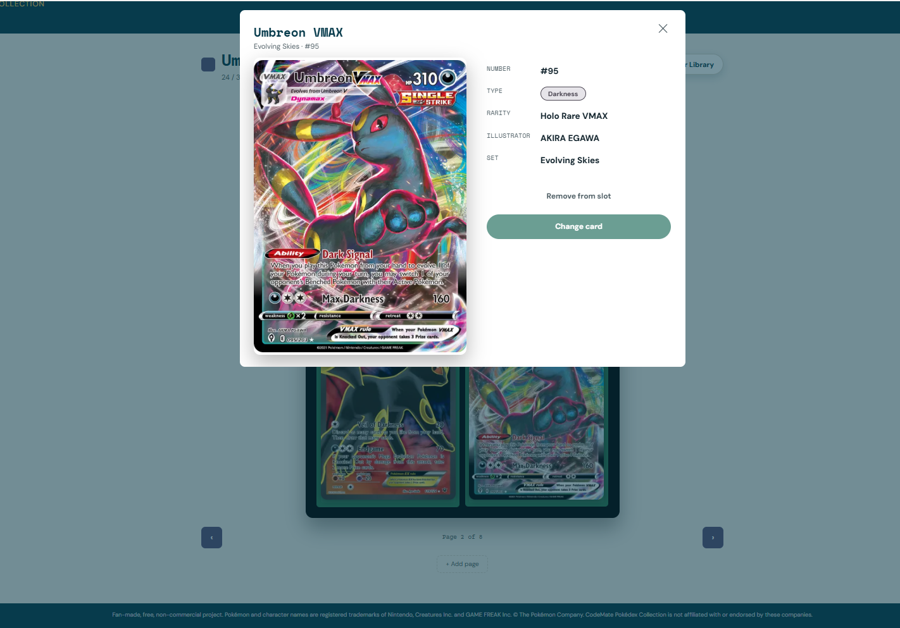
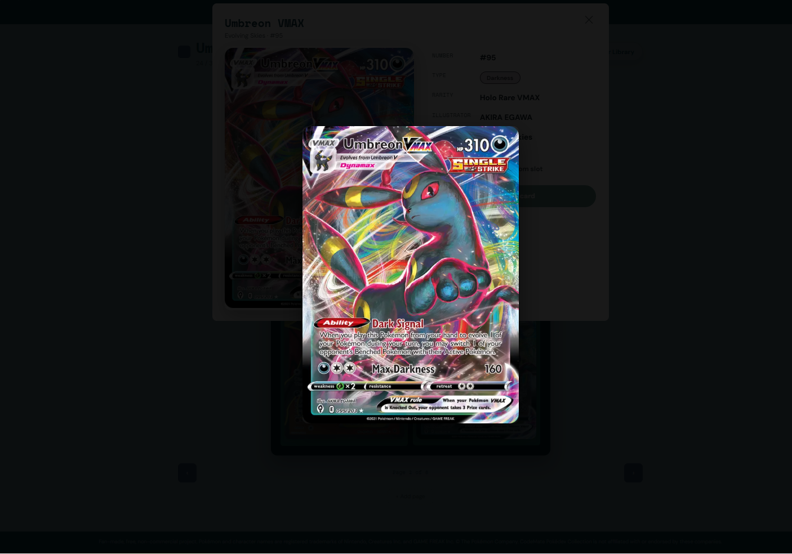
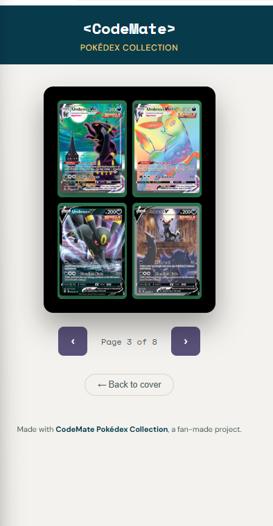

# &lt;CodeMate&gt; Pokédex Collection

A virtual Pokémon TCG binder app: build themed collections, browse a real catalog of 23,000+ English cards (and 15,000+ Spanish cards), and track your progress — all running as a static site, no backend, no database.

**🔗 Live demo:** https://devcodemate.github.io/codemate-pokedex-collection/

Fan-made, free, non-commercial project. Not affiliated with or endorsed by Nintendo, Creatures Inc., GAME FREAK Inc., or The Pokémon Company.

---

## Table of contents

- [Overview](#overview)
- [Features](#features)
- [Tech stack](#tech-stack)
- [Architecture](#architecture)
- [Data pipeline](#data-pipeline)
- [Project structure](#project-structure)
- [Running locally](#running-locally)
- [What I learned](#what-i-learned)
- [Roadmap](#roadmap)
- [Credits & disclaimer](#credits--disclaimer)

---

## Overview

CodeMate Pokédex Collection lets you build your own themed Pokémon TCG binders — pick a cover color, a size (Small/Square/Medium/Large), a folio color, and a card language (English or Spanish) — then fill each slot by searching a real, complete card catalog sourced from [TCGdex](https://tcgdex.dev/). Everything is saved locally in the browser (`localStorage`), no account or login required.

The project was built in two phases:

1. **Phase 1** — UI/UX foundations with mock data: the 3-step wizard, the 3D-flip binder view, responsive layout, and the full bilingual i18n system.
2. **Phase 2** — a real, production-grade data pipeline replacing the mock data with the complete TCGdex catalog, plus a full search/filter system (by name, number, illustrator, generation, rarity, and type).

## Features

- **3-step binder wizard** — name, cover color, size (Small 2×2, Square 3×3, Medium 4×3, or Large 5×4), folio color, and card language, with a live preview at every step.
- **3D page-flip binder view** — a custom CSS 3D transform animation, no external animation library.
- **Real card search** — chunked, on-demand loading (never downloads the full 23k/15k-card catalog at once): search by name/number, or filter by illustrator, generation ("era"), rarity, or type.
- **Card detail modal** with a full-screen lightbox zoom for closer inspection.
- **Bilingual card catalog** (English / Spanish) — each binder locks in its card language at creation time, since card IDs and catalogs differ between TCGdex locales.
- **Exportable binder** — turn any binder into a standalone, downloadable `.html` "keepsake" file: a cover page plus every filled page, hoverable/flippable, viewable offline-first (only card images need network access), shareable by email or messaging apps.
- **Full i18n system** (English default / Spanish), with automatic `<html lang>` switching and a persistent language toggle.
- **Fully responsive**, from a 2×2 pocket binder on mobile to a 5×4 "Large" binder on desktop.
- **Automated monthly data refresh** via GitHub Actions — the full English + Spanish catalog is re-fetched and re-indexed on the 1st of every month, with an automatic commit if anything changed.
- **Zero backend** — 100% static site, deployable to GitHub Pages as-is.

## Screenshots

| Your Library | Binder wizard — Step 1 |
|---|---|
|  |  |

| Wizard — Step 2 (size) | Wizard — Step 3 (folio) |
|---|---|
|  |  |

| Binder view (3D page flip) | Card detail modal |
|---|---|
|  |  |

| Full-screen lightbox zoom | Exported standalone binder |
|---|---|
|  |  |

## Tech stack

- **Vanilla HTML, CSS, and JavaScript** — no frameworks, no build step, no bundler.
- **Node.js** (dev-only) for the data pipeline scripts (`scripts/fetch-tcgdex.js`, `scripts/build-indices.js`) — never shipped to production, only used to generate the static `/data` folder.
- **GitHub Actions** — runs the data pipeline automatically once a month, keeping the catalog current with zero manual work.
- **TCGdex API** (`api.tcgdex.net`) as the card data source.
- **GitHub Pages** for deployment.
- **localStorage** for all user data persistence (binders, pages, language preference) — no database, no server, no user accounts.

## Architecture

```
User's browser
   │
   ├── index.html + style.css        → UI shell, all views (library / wizard / binder)
   ├── i18n.js                       → translation strings + language switching
   ├── storage.js                    → localStorage read/write layer (binders index + per-binder pages)
   ├── data-service.js               → fetches JSON from /data/{lang}/... , caches per language
   ├── render-card.js                → renders a card face (real artwork, or an SVG placeholder as fallback)
   ├── wizard.js / library.js /
   │   binder.js / buscador.js /
   │   card-detail.js                → one file per view/feature, each owning its own DOM + events
   ├── export.js                     → builds a standalone .html "keepsake" file, embedding its own CSS/JS
   └── app.js                        → tiny router, wires up global event listeners

Static data (generated ahead of time, refreshed monthly by GitHub Actions):
   /data/en/...   → English catalog (23,315+ cards, 146 sets)
   /data/es/...   → Spanish catalog (15,164+ cards, 146 sets)
      /sets.json                     → lightweight set metadata (used for filtering by generation)
      /cards/by-set/{setId}.json     → full card detail per set (attacks, rarity, illustrator, etc.)
      /indices/facets.json           → rarities/types/illustrators/generations, for populating filters
      /indices/by-illustrator/*.json → cards grouped by illustrator
      /indices/by-generation/*.json  → cards grouped by era (Base, Neo, Sword & Shield, Scarlet & Violet...)
      /indices/search/{a-e,f-j,...}.json → full catalog, alphabetically chunked for name search
```

**Key design decision:** the app never loads the entire catalog into memory. Every search or filter action fetches only the specific JSON chunk it needs (a single illustrator's cards, a single alphabetical bucket, a single set's full detail) and caches it — so opening the search modal for the first time costs a few KB, not the full multi-MB catalog.

## Data pipeline

Two Node.js scripts, plus a GitHub Actions workflow that runs them automatically:

1. **`scripts/fetch-tcgdex.js --lang={en|es}`** — pulls every set and every card from the TCGdex API for a given language, with automatic retries, resumability (skips sets already cached unless `--force` is passed), and a resilient two-path fetch per card (falls back to a secondary endpoint for edge cases like Unown's "?" card, whose ID breaks the primary endpoint).
2. **`scripts/build-indices.js --lang={en|es}`** — reads everything fetched above and builds the lightweight search indices the front-end actually consumes (by-illustrator, by-generation, alphabetical search chunks, and the facets used to populate filter dropdowns/chips).
3. **`.github/workflows/refresh-data.yml`** — runs both scripts for both languages on the 1st of every month (also triggerable manually from the Actions tab), and commits the refreshed catalog only if something actually changed.

Both scripts are idempotent and safe to re-run; `build-indices.js` always regenerates its output from scratch so the indices never drift from the underlying card data.

**A note on catalog completeness:** TCGdex is an open, community-maintained database — it is not an official Pokémon Company source. It's actively growing, but some very recent cards, regional promos, or niche variants may not be catalogued there yet. If a card is missing from a search, it's likely not yet available in TCGdex itself rather than a bug in this app's pipeline. The monthly automated refresh (see below) picks up new sets and cards as soon as TCGdex adds them.

## Project structure

```
codemate-pokedex-collection/
├── .github/
│   └── workflows/
│       └── refresh-data.yml
├── index.html
├── style.css
├── i18n.js
├── data-service.js
├── storage.js
├── render-card.js
├── wizard.js
├── library.js
├── binder.js
├── buscador.js
├── card-detail.js
├── export.js
├── app.js
├── images/
│   ├── codemate-avatar.png
│   ├── rack.png
│   └── screenshots/ ...
├── data/
│   ├── en/ ...
│   └── es/ ...
└── scripts/
    ├── fetch-tcgdex.js
    └── build-indices.js
```

## Running locally

No build step, no package manager needed for the app itself:

1. Clone the repo.
2. Open the folder in VS Code and run it with the **Live Server** extension (or any static file server — the app only needs to be served over HTTP, not opened as a `file://` path, since it uses `fetch()` to load JSON).
3. That's it — the `/data` folder ships with the repo, already generated.

To regenerate the data pipeline yourself (only needed if you want to refresh the catalog outside of the monthly automated run):

```bash
node scripts/fetch-tcgdex.js --lang=en
node scripts/build-indices.js --lang=en

node scripts/fetch-tcgdex.js --lang=es
node scripts/build-indices.js --lang=es
```

Requires Node 18+ (uses native `fetch`, no dependencies).

## What I learned

- **Designing a data pipeline separate from the app itself** — the Node scripts that fetch and index card data never ship to the browser; they're a build-time concern, which keeps the production app to pure vanilla front-end code with zero dependencies.
- **Automating maintenance with GitHub Actions** — instead of manually re-running the pipeline whenever the catalog might have changed, a scheduled workflow handles it monthly with zero manual work, and only commits when something actually changed.
- **Chunking strategy for large datasets in a static site** — with no backend to query on demand, the "database" has to be pre-split into the shapes the UI will actually ask for (by illustrator, by generation, alphabetically) ahead of time, so the browser never has to filter 23,000 records client-side.
- **CSS 3D transforms** for the page-flip animation (`transform-style: preserve-3d`, `rotateY`, `transform-origin`) without any animation library.
- **Designing around `localStorage`'s constraints** — no accounts, no server, but also no cross-device sync; this shaped the decision to add a standalone HTML export feature, so a user's collection isn't trapped in a single browser.
- **Internationalization from scratch** — a small `t(key, vars)` translation helper, `data-i18n` attributes for static HTML, and a `languagechange` event so every dynamically-rendered view re-renders itself in the new language without a page reload.
- **Building a self-contained, portable HTML file** — the export feature generates a `.html` document with its own embedded CSS and JS (no dependency on the rest of the app's files), which was a good exercise in thinking about what a "deliverable" artifact needs versus what the live app needs.

## Roadmap

- [ ] Cross-binder global search
- [ ] Binder editing improvements (reordering pages, bulk actions)
- [ ] Japanese card catalog (on-demand loading, to avoid bloating the initial data payload)
- [ ] Import a previously exported binder back into the app

## Credits & disclaimer

Built by [CodeMate](https://github.com/devCODEMATE) as a fan-made, free, non-commercial portfolio project.

Card data provided by [TCGdex](https://tcgdex.dev/), an open, community-maintained Pokémon TCG database.

Pokémon and character names are registered trademarks of Nintendo, Creatures Inc., and GAME FREAK Inc. © The Pokémon Company. This project is not affiliated with or endorsed by any of these companies.

---

<br>

# &lt;CodeMate&gt; Pokédex Collection (Español)

Una app de carpetas virtuales de Pokémon TCG: armá colecciones temáticas, navegá un catálogo real de más de 23.000 cartas en inglés (y más de 15.000 en español), y llevá el registro de tu progreso — todo corriendo como un sitio estático, sin backend, sin base de datos.

**🔗 Demo en vivo:** https://devcodemate.github.io/codemate-pokedex-collection/

Proyecto fan-made, gratuito y sin fines comerciales. No afiliado ni respaldado por Nintendo, Creatures Inc., GAME FREAK Inc., ni The Pokémon Company.

---

## Resumen

CodeMate Pokédex Collection te deja armar tus propias carpetas temáticas de Pokémon TCG — elegís un color de tapa, un tamaño (Chica/Cuadrada/Mediana/Grande), un color de folio y un idioma de cartas (inglés o español) — y después llenás cada slot buscando en un catálogo real y completo, sacado de [TCGdex](https://tcgdex.dev/). Todo se guarda localmente en el navegador (`localStorage`), sin cuenta ni login.

El proyecto se construyó en dos fases:

1. **Fase 1** — bases de UI/UX con datos de prueba: el wizard de 3 pasos, la vista de carpeta con vuelta de página 3D, diseño responsive, y el sistema completo de i18n bilingüe.
2. **Fase 2** — un pipeline de datos real y de nivel producción que reemplazó los datos de prueba por el catálogo completo de TCGdex, más un sistema completo de búsqueda/filtros (por nombre, número, ilustrador, generación, rareza y tipo).

## Funcionalidades

- **Wizard de carpeta en 3 pasos** — nombre, color de tapa, tamaño (Chica 2×2, Cuadrada 3×3, Mediana 4×3 o Grande 5×4), color de folio e idioma de cartas, con vista previa en vivo en cada paso.
- **Vista de carpeta con vuelta de página 3D** — animación 3D armada con CSS puro, sin ninguna librería de animación externa.
- **Búsqueda real de cartas** — carga en bloques, bajo demanda (nunca descarga el catálogo completo de 23k/15k cartas de una sola vez): buscá por nombre/número, o filtrá por ilustrador, generación ("era"), rareza o tipo.
- **Modal de detalle de carta** con zoom a pantalla completa (lightbox) para ver el arte más de cerca.
- **Catálogo de cartas bilingüe** (inglés / español) — cada carpeta fija su idioma de cartas al crearse, porque los IDs y catálogos difieren entre los idiomas de TCGdex.
- **Carpeta exportable** — convertí cualquier carpeta en un archivo `.html` descargable y autónomo, tipo "recuerdo": una portada más cada hoja llena, hojeable, viewable sin conexión en su mayor parte (solo las imágenes de las cartas necesitan internet), compartible por mail o mensajería.
- **Sistema de i18n completo** (inglés por defecto / español), con cambio automático de `<html lang>` y un botón de idioma persistente.
- **Totalmente responsive**, desde una carpeta de bolsillo 2×2 en celular hasta una carpeta "Grande" 5×4 en escritorio.
- **Actualización automática mensual de datos** vía GitHub Actions — el catálogo completo en inglés y español se vuelve a descargar e indexar el día 1 de cada mes, con commit automático si hubo cambios.
- **Sin backend** — sitio 100% estático, deployable en GitHub Pages tal cual está.

## Capturas de pantalla

| Tu biblioteca | Wizard — Paso 1 |
|---|---|
|  |  |

| Wizard — Paso 2 (tamaño) | Wizard — Paso 3 (folio) |
|---|---|
|  |  |

| Vista de carpeta (vuelta de página 3D) | Modal de detalle de carta |
|---|---|
|  |  |

| Zoom a pantalla completa (lightbox) | Carpeta exportada, standalone |
|---|---|
|  |  |

## Stack tecnológico

- **HTML, CSS y JavaScript puros** — sin frameworks, sin paso de build, sin bundler.
- **Node.js** (solo en desarrollo) para los scripts del pipeline de datos (`scripts/fetch-tcgdex.js`, `scripts/build-indices.js`) — nunca se envían a producción, solo se usan para generar la carpeta estática `/data`.
- **GitHub Actions** — corre el pipeline de datos automáticamente una vez al mes, manteniendo el catálogo actualizado sin trabajo manual.
- **API de TCGdex** (`api.tcgdex.net`) como fuente de datos de cartas.
- **GitHub Pages** para el deploy.
- **localStorage** para toda la persistencia de datos del usuario (carpetas, hojas, preferencia de idioma) — sin base de datos, sin servidor, sin cuentas de usuario.

## Qué aprendí

- **Diseñar un pipeline de datos separado de la app en sí** — los scripts de Node que traen e indexan los datos de cartas nunca llegan al navegador; son una preocupación de "tiempo de build", lo que deja a la app de producción como puro front-end vanilla sin dependencias.
- **Automatizar el mantenimiento con GitHub Actions** — en vez de correr el pipeline a mano cada vez que el catálogo podría haber cambiado, un workflow programado se encarga solo cada mes, y solo hace commit cuando hubo cambios reales.
- **Estrategia de "chunking" para datasets grandes en un sitio estático** — sin backend para consultar bajo demanda, la "base de datos" tiene que pre-dividirse en las formas que la interfaz realmente va a pedir (por ilustrador, por generación, alfabéticamente) de antemano, para que el navegador nunca tenga que filtrar 23.000 registros del lado del cliente.
- **Transformaciones 3D en CSS** para la animación de vuelta de página (`transform-style: preserve-3d`, `rotateY`, `transform-origin`) sin ninguna librería de animación.
- **Diseñar en torno a las limitaciones de `localStorage`** — sin cuentas, sin servidor, pero tampoco sincronización entre dispositivos; esto motivó la decisión de agregar una función de exportación a HTML standalone, para que la colección de una persona no quede atrapada en un solo navegador.
- **Internacionalización desde cero** — un pequeño helper de traducción `t(clave, variables)`, atributos `data-i18n` para el HTML estático, y un evento `languagechange` para que cada vista renderizada dinámicamente se vuelva a dibujar en el nuevo idioma sin recargar la página.
- **Construir un archivo HTML autónomo y portable** — la función de exportar genera un documento `.html` con su propio CSS y JS embebidos (sin depender del resto de los archivos de la app), un buen ejercicio para pensar qué necesita un "entregable" versus qué necesita la app en vivo.

## Roadmap

- [ ] Búsqueda global cruzando todas las carpetas
- [ ] Mejoras de edición de carpetas (reordenar hojas, acciones en lote)
- [ ] Catálogo de cartas en japonés (carga bajo demanda, para no inflar la carga inicial de datos)
- [ ] Importar una carpeta previamente exportada de vuelta a la app

## Créditos y aclaración

Hecho por [CodeMate](https://github.com/devCODEMATE) como un proyecto de portfolio fan-made, gratuito y sin fines comerciales.

Datos de cartas provistos por [TCGdex](https://tcgdex.dev/), una base de datos abierta y mantenida por la comunidad de Pokémon TCG.

Pokémon y los nombres de personajes son marcas registradas de Nintendo, Creatures Inc. y GAME FREAK Inc. © The Pokémon Company. Este proyecto no está afiliado ni respaldado por ninguna de estas empresas.